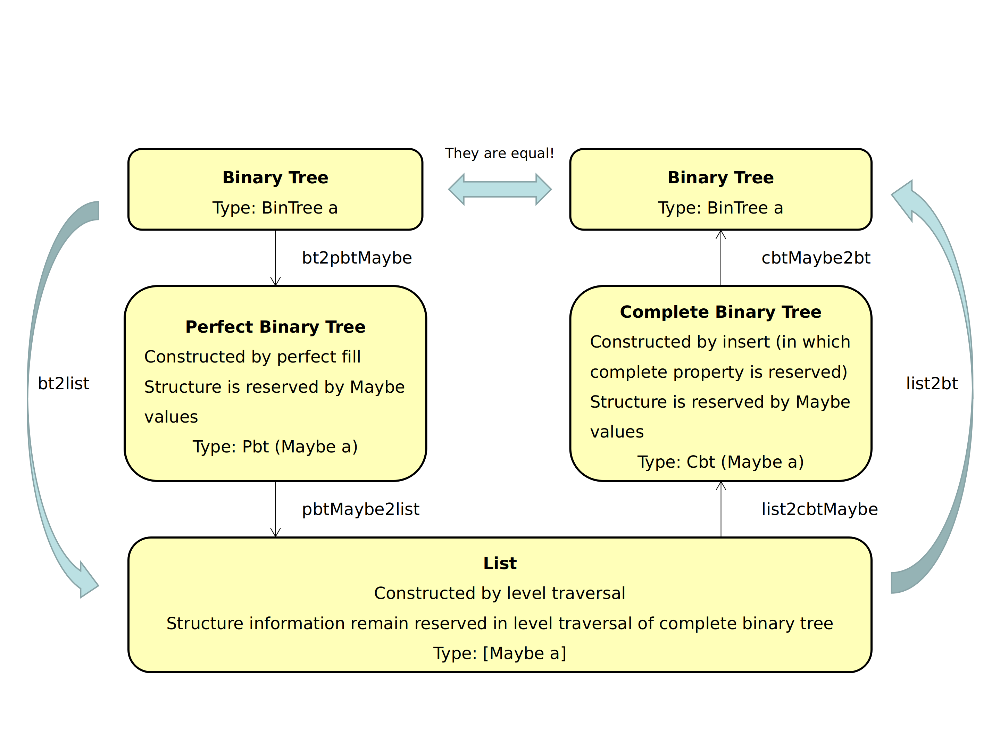

Haskell递归数据结构：二叉树02b-二叉树和列表之间的转换（下）

在之前三篇文章的铺垫下，终于到重要部分了！本文的内容是，在递归定义的二叉树概念上，借助完全二叉树和完美二叉树的概念，进行二叉树和保结构的层序列表的相互转换。

# 前言

本文设计的`bt2list`和`list2bt`函数，将如下的二叉树和层序列表进行相互转换：

```
bt = Node (Node (Node Empty 6 (Node Empty 4 Empty)) 2 Empty) 1 (Node Empty 10 (Node Empty 15 Empty))
list = [Just 1,Just 2,Just 10,Just 6,Nothing,Nothing,Just 15,Nothing,Just 4]

bt2list bt == list
list2bt list == bt
```

```
bt:
    1
   / \
  2   10 
 /     \
6       15
 \
  4
```

在非递归数据结构中，借助类似C语言数组的数据结构存储一棵树，这件事很容易完成。然而在递归定义二叉树的结构时，就没有那么容易设计`bt2list`和`list2bt`函数。下文就是对设计细节的介绍。

阅读本文前建议首先阅读:
- 二叉树01a：二叉树的基本定义
- 二叉树01b：层序遍历
- 二叉树02a：完全二叉树和完美二叉树，下文分别称为cbt和pbt

相关代码在[BinTree.WithList](https://github.com/WinterShiver/Recursive-Data-Structures/blob/master/BinTree/WithList.hs)和[BinTree.WithListCheck](https://github.com/WinterShiver/Recursive-Data-Structures/blob/master/BinTree/WithListCheck.hs).

# 二叉树转为列表

分为两步：
- 第一步，将原始二叉树转化为`Pbt (Maybe a)`，将二叉树填充成等深的完美二叉树，空缺位置用Nothing填充，非空缺位置也套Just.
- 第二步，利用完全二叉树通过层序遍历不丢失结构信息的性质，将完美二叉树层序遍历成列表，并去掉尾部的无用信息。

参考这张图的左半边。



## 二叉树填充为完美二叉树

即做如下的过程：

```
Sample Input: 
    1
   / \
  2   10 
 /     \
6       15
 \
  4

Sample Output:
         Just 1
        /      \
  Just 2        Just 10 
 /      \       /      \
Just 6 Nothing Nothing Just 15
 / \     /  \    /  \    /   \
N   J4  N    N  N    N  N     N
```

把一个`BinTree a`，转化为一个深度相同、结构对应的`Pbt (Maybe a)`：原来树中无元素的地方用值为Nothing的结点填充，有元素值k的地方用Just k代替。算法是，在构造`Pbt (Maybe a)`时，通过尾递归传递深度参数，保证函数结果和输入的深度相同；通过递归对每个位置做对应，逐个位置确定元素值。

```haskell
bt2pbtMaybe :: BinTree a -> Pbt (Maybe a)
bt2pbtMaybe Empty = Empty
bt2pbtMaybe tree = fill (tree, depth tree) where
    fill (_, 0) = Empty
    fill (Empty, n) = Node (fill (Empty, n-1)) Nothing (fill (Empty, n-1))
    fill (Node l k r, n) = Node (fill (l, n-1)) (Just k) (fill (r, n-1))
```

在递归中将深度作为状态传递，保证在空树的情况下，也能创建出结构完整的pbt（获得的子树是一棵全是Nothing的pbt）。

## 完美二叉树转化为层序列表

**完全二叉树转化为层序列表**

层序遍历将二叉树转化为列表，如果这棵树是complete的，就没有结构上的信息丢失。我们（马后炮地）用QuickCheck验证这件事：

```haskell
prop_complete_level_traversal :: BinTree Integer -> Bool
prop_complete_level_traversal tree = 
    complete tree || bt2list tree /= map Just (levelOrderTraversal tree)
```

然后当然验证通过了:

```haskell
*BinTree.WithListCheck> quickCheck prop_complete_level_traversal 
+++ OK, passed 100 tests.
```

所以，可以重新封装层序遍历函数为`cbt2list`，这个函数将一个`Cbt a`转化成其元素层序遍历的列表`[a]`。

```haskell
cbt2list :: Cbt a -> [a]
cbt2list = levelOrderTraversal
```

我们使用`cbt2list`的目的是把不丢失结构信息的性质提炼出来：
在表面上看，`cbt2list`是`levelOrderTraversal`的一个特化。但实际要表达的意思是，我们用`cbt2list`将一个`Cbt a`转化成`[a]`，`cbt2list`保证在这个过程中不丢失二叉树的结构信息。`levelOrderTraversal`仅是`cbt2list`的实现方式而已。

**完美二叉树转化为层序列表**

因为上一部得到的`Pbt (Maybe a)`也满足complete的性质，所以用`pbtMaybe2list :: Pbt (Maybe a) -> [Maybe a]`把上一步得到的pbt转化为列表，同时不丢失信息：

```haskell
pbtMaybe2list :: Pbt (Maybe a) -> [Maybe a]
pbtMaybe2list = removeTailNothings . cbt2list where
    removeTailNothings = reverse . removeHeadNothings . reverse
    removeHeadNothings = dropWhile isNothing
```

这里的`pbtMaybe2list`不仅是对`cbt2list`的特化，特殊指明上一个步骤获得的pbt转成列表的步骤；还对`cbt2list`得到的列表进行修缮。上面的例子中，`BinTree a`转为`Pbt (Maybe a)`后，后面多了很多Nothing，这些Nothing在`Pbt (Maybe a)`中是补全底层右侧位置用的。这些多余的Nothing导致直接`cbt2list`出来的列表后面有很多Nothing，这些Nothing需要接一个步骤`removeTailNothings`去掉。

## 完成二叉树转列表

组合上述两个步骤：

```haskell
bt2list :: BinTree a -> [Maybe a]
bt2list = pbtMaybe2list . bt2pbtMaybe
```

效果：

```haskell
*BinTree.WithListCheck> bt2list $ Node (Node (Node Empty 6 (leaf 4)) 2 Empty) 1 (Node Empty 10 (leaf 15))
[Just 1,Just 2,Just 10,Just 6,Nothing,Nothing,Just 15,Nothing,Just 4]
```

## 辅助验证其他性质

在实现了`bt2list`之后，我们很自然地产生了一些想法：
- 二叉树的complete，等价于对这棵树做`bt2list`之后，列表里面的值全部是Just，没有Nothing.
- 二叉树的perfect，等价于这棵树是complete，而且结点个数是2^n-1（在层数为n的情况下）。

这些想法都可以简单地用QuickCheck验证：

```haskell
prop_complete :: BinTree Integer -> Bool
prop_complete tree = 
    complete tree == isJust (sequenceA $ bt2list tree) 

prop_perfect :: BinTree Integer -> Bool
prop_perfect tree = 
    perfect tree == (complete tree && 
        2 ^ depth tree - 1 == length (bt2list tree)
    )
```

这两个测试都可以通过，证明了我们的猜想。

（当然还有更简单、更有效、或更好的方法验证complete和perfect定义的正确性。这里只是QuickCheck的使用举例。）

# 列表转为二叉树

这一部分，我的实现比较麻烦：
- 第一步，设计一个保complete的插入（insert）函数，然后通过对空树逐个插入`Maybe a`类型的元素，获得`Cbt (Maybe a)`. 这样做的好处是保留了结构信息。
- 第二步，保结构地对二叉树元素做替换，`a`替换掉`Maybe a`，空树替换掉`Nothing`，还原原来的二叉树。

参考这张图的右半边。


## 列表转为完全二叉树

首先是保complete的插入：

```haskell
insertCbt :: a -> Cbt a -> Cbt a
insertCbt m Empty = leaf m 
insertCbt m (Node l k r) 
    | empty l || not (perfect l) = Node (insertCbt m l) k r
    | empty r || not (perfect r) = Node l k (insertCbt m r)
    | depth l /= depth r = Node l k (insertCbt m r)
    | otherwise = Node (insertCbt m l) k r
```

这个函数对应我们上一篇文章介绍的插入过程：

> 1. 首先是一棵perfect，此时左右子树是深度相同的perfect，下一个结点插入底层的最左侧；
> 2. 在底层从左到右插入结点，插入结点个数少于一半时，左侧变成深一层的complete，右子树依然是perfect；
> 3. 在插入一半时，左侧底层插满深一层的perfect，右侧是perfect；
> 4. 继续插入，左右深度重新相同，左侧perfect右侧complete；
> 5. 底层完全插满，左右都变成深度相同的perfect，下一个结点插入下一层的最左侧。

左侧空或左侧未满，插入左侧；左侧满右侧空或未满，插入右侧；两侧都满，判断是左插完右没插，还是都已插完进入下一层。

在有了插入函数之后，`constructCbtFromList`就是将一个列表的元素，按照从上到下、同层从左到右的顺序插入一棵空树，建立一棵cbt：

```haskell
-- constructCbtFromList: construct a cbt from the list
constructCbtFromList :: [a] -> Cbt a
constructCbtFromList = foldl (flip insertCbt) Empty
```

试验一下效果。首先QuickCheck一下，发现获得的树都满足cbt的性质：

```haskell
prop_complete_insert :: [Integer] -> Bool
prop_complete_insert xs = complete (constructCbtFromList xs)
```

然后做两个实际例子：

```haskell
-- constructCbtFromList successfully gives the result of cbt 
> goodShow $ constructCbtFromList [Just 1,Just 2,Just 10,Just 4,Nothing,Nothing,Just 15]
"(Node (Node (Leaf Just 4) Just 2 (Leaf Nothing)) Just 1 (Node (Leaf Nothing) Just 10 (Leaf Just 15)))"
> goodShow $ constructCbtFromList [Just 1,Just 2,Just 10,Just 6,Nothing,Nothing,Just 15,Nothing,Just 4]
"(Node (Node (Node (Leaf Nothing) Just 6 (Leaf Just 4)) Just 2 (Leaf Nothing)) Just 1 (Node (Leaf Nothing) Just 10 (Leaf Just 15)))"
```

和预想相同。

最后，和上文一样，把建造cbt的过程特化到本问题上：

```haskell
list2cbtMaybe :: [Maybe a] -> Cbt (Maybe a)
list2cbtMaybe = constructCbtFromList
```

## 完全二叉树转为所求的二叉树

```haskell
cbtMaybe2bt :: Cbt (Maybe a) -> BinTree a
cbtMaybe2bt Empty = Empty
cbtMaybe2bt (Node l k r) = case k of
    Nothing -> Empty
    Just k' -> Node (cbtMaybe2bt l) k' (cbtMaybe2bt r)
```

这里在保结构的情况下，替换掉了所有的`Maybe a`值，其中以Nothing为根节点的树全部用空树替换。

最后和上文一样，结合两个步骤：

```haskell
list2bt :: [Maybe a] -> BinTree a
list2bt = cbtMaybe2bt . list2cbtMaybe
```

## 性质的测试

我们用可逆性验证`bt2list`和`list2bt`这两个函数的正确性：

```haskell
prop_WithList :: BinTree Integer -> Bool
prop_WithList tree = (tree == (list2bt . bt2list) tree) 
    && (lst == (bt2list . list2bt) lst) where 
        lst = bt2list tree
```

（这里的验证方法并不严格，只是举例。）

所以，这篇文章最大的用处似乎是告诉我们存取模型的重要性……